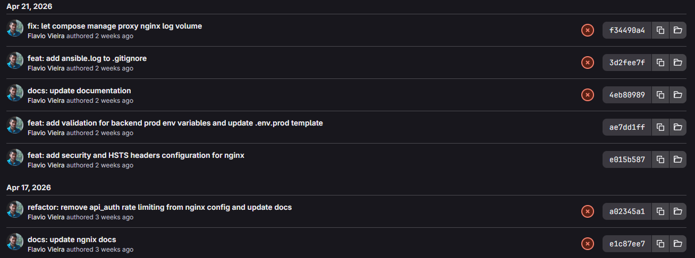
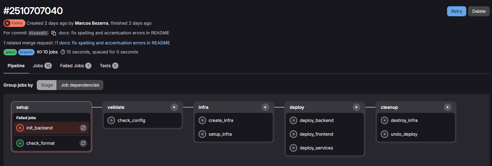
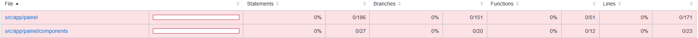
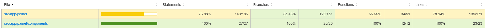
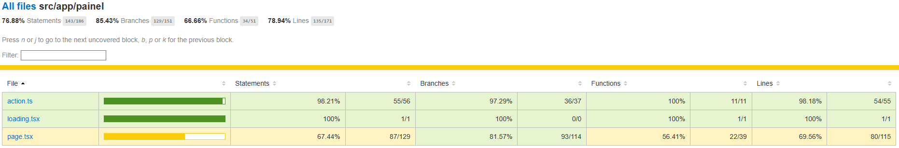
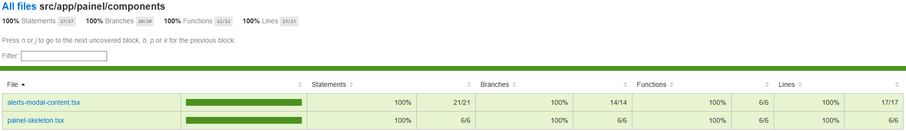
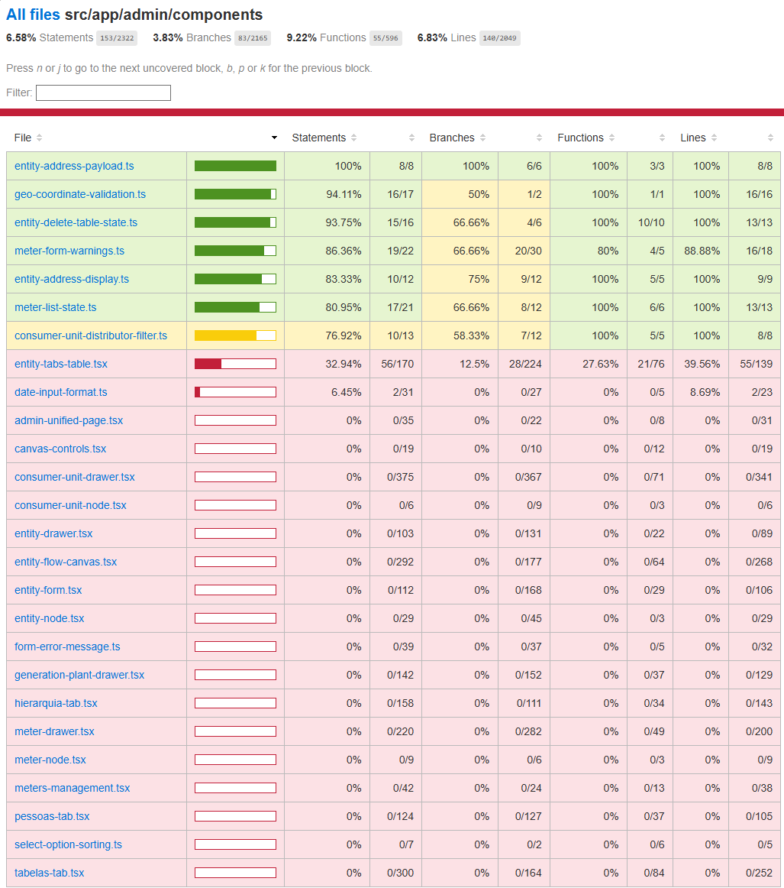
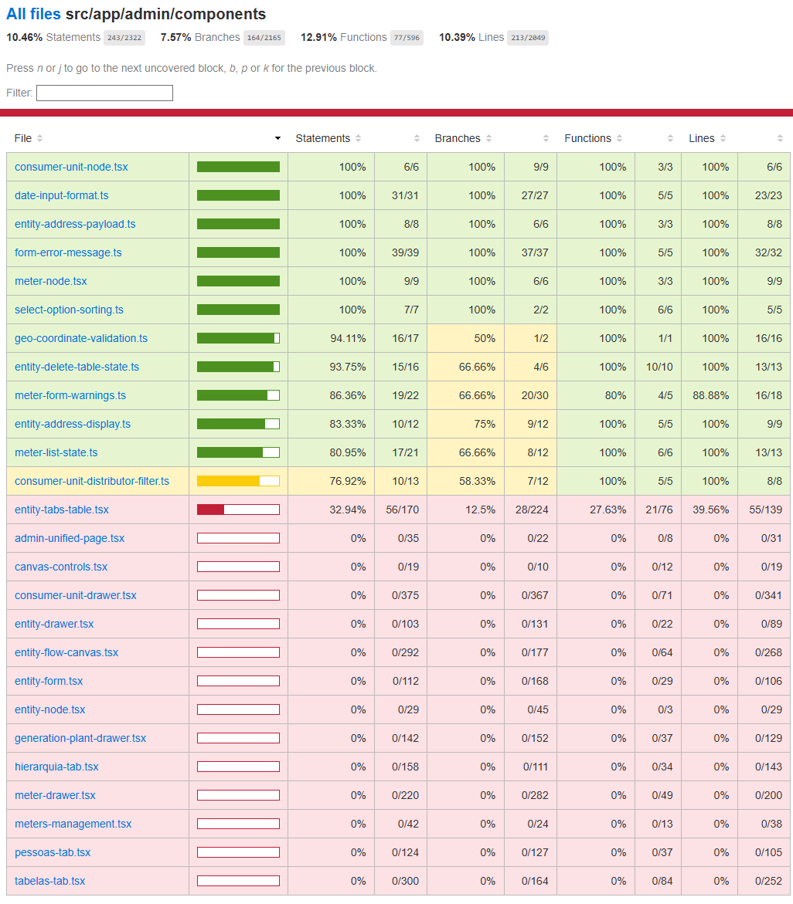

# Diário de Bordo - Marcos Bezerra

Esta seção tem como objetivo registrar, ao longo das sprints, o acompanhamento individual das atividades realizadas por cada integrante do grupo.

A cada sprint, cada membro irá documentar sua experiência no projeto, descrevendo as tarefas realizadas, dificuldades encontradas, decisões tomadas e aprendizados adquiridos durante o processo de contribuição no MEPA. Além disso, o diário de bordo funciona como um histórico do desenvolvimento do projeto, tornando rastreável o processo de contribuição em um ambiente de software livre.

---
## Sprint 0 - Documentação
**Duração**: 06/04/2026 - 22/04/2026

### Resumo da Sprint

Nesta sprint, o foco principal foi preparar a base para as próximas contribuições no projeto MEPA. Além de conseguir subir o ambiente e compreender melhor a estrutura do repositório, também foi necessário iniciar a documentação do nosso próprio grupo, organizando o espaço onde serão registradas as sprints, atas e demais entregas da disciplina.

### Atividades Realizadas

| Data | Atividade | Tipo | Referência | Status |
| ----- | --------- | ---------------------------------------- | --------------- | ------ |
| 16/04 | Configuração do MkDocs no repositório do grupo | Código/Doc | [GitHub](https://github.com/matheusperillo03/GCES-MEPA-GH_PAGES-2026-1) | Concluído✅ |
| 16/04  | Criação da branch `docs` e organização da documentação | Código/Doc | [Branch Docs](https://github.com/matheusperillo03/GCES-MEPA-GH_PAGES-2026-1/tree/docs) | Concluído✅ |
| 17/04  | Configuração de CD para build automático da documentação | Código | [Código](https://github.com/matheusperillo03/GCES-MEPA-GH_PAGES-2026-1/blob/docs/.github/workflows/CD-DeployMkdocs.yml) | Concluído✅ |
| 17/04  | Estudo da estrutura do repositório MEPA | Estudo | [Repositório MEPA](https://gitlab.com/lappis-unb/projetos-energia/mepa) | Concluído✅ |
| 17/04  | Análise dos 3 repositórios do grupo MEPA no GitLab | Estudo | [Repositório MEPA](https://gitlab.com/lappis-unb/projetos-energia/mepa) | Concluído✅ |
| 17/04  | Levantamento inicial de issues do projeto | Estudo | [Repositório MEPA](https://gitlab.com/lappis-unb/projetos-energia/mepa) | Concluído✅ |
| 18/04  | Criação da página da Sprint 0 na documentação | Doc | [Sprint 0](../sprints/sprint0.md) | Concluído✅ |
| 20/04  | Redação da ata da reunião 1 do grupo | Doc | [Ata 1](../atas//ata1.md) | Concluído✅ |

### Maiores Avanços

Consegui estruturar a base da documentação do grupo, deixando o MkDocs funcionando no repositório e com deploy automático configurado. Isso ajudou a organizar melhor o fluxo de trabalho da equipe e facilitou a construção das páginas que serão usadas ao longo da disciplina.

Além disso, o estudo inicial do repositório MEPA foi importante para entender como o projeto está dividido e como as partes do sistema se relacionam. Ao identificar que o projeto é separado em três repositórios principais, ficou mais claro onde cada tipo de contribuição pode acontecer e como o trabalho do grupo deve ser direcionado.

Também foi possível iniciar o levantamento de issues e entender melhor o perfil das tarefas disponíveis, o que será útil para definir contribuições mais adequadas nas próximas sprints.

### Dificuldades

Uma das dificuldades dessa sprint foi na comunicação e entendimento da disciplina. Demorou um tempo para eu entender de fato do que de fato seria abordado na disciplina e o que era esperado na Sprint 0. Após estudar um pouco repositórios de grupos passados essa dúvida foi sanada

Outra questão foi o onboarding com o MEPA, houve um pouco de dificuldade para marcar a reunião devido as demandas da universidade e os horários disponíveis dos mantenedores.

### Aprendizados

Durante essa sprint, aprendi mais sobre a estrutura de um projeto de software livre em um contexto real, principalmente sobre a divisão entre frontend, backend e infraestrutura. Também tive contato mais prático com a configuração do MkDocs e com a automação de deploy da documentação, o que ajudou bastante na organização do repositório do grupo.

### Plano Pessoal para a Próxima Sprint

Na próxima sprint, pretendo começar a me aprofundar mais nas issues do MEPA para identificar possíveis contribuições mais simples e adequadas ao nosso nível de familiaridade com o projeto.

---

## Sprint 1 - Primeira Contribuição
**Duração**: 27/04/2026 - 11/05/2026

### Resumo da Sprint

Nesta sprint, realizei minha primeira contribuição efetiva ao projeto MEPA, focada em documentação. A tarefa consistiu em corrigir erros de ortografia e acentuação no `README.md` do repositório `mepa-infra`. Além disso, durante o processo de submissão da contribuição, identifiquei um problema consistente no pipeline de CI/CD relacionado à autenticação do Terraform com o backend remoto. 

Devido ao alto volume de demandas e à agenda corrida dos mantenedores, não foi possível que eles preparassem issues específicas para nossa equipe(que seriam relacionadas a testes), conforme havia sido alinhado inicialmente. Diante disso, fomos orientados a buscar por issues simples, como por exemplo aquelas com ênfase na documentação do MEPA (web, api e infra). Foi nos dado um certo grau de liberdade para escolher como contribuir.

### Atividades Realizadas

| Data | Atividade | Tipo | Referência | Status |
|------|-----------|------|------------|--------|
| 28/04 | Análise de issues disponíveis nos repositórios MEPA | Estudo | [MEPA Infra](https://gitlab.com/lappis-unb/projetos-energia/mepa/mepa-infra/-/tree/main) | Concluído ✅ |
| 08/05 | Correção de erros de português no README do repositório fork `mepa-infra` | Código/Doc | [Commit](https://gitlab.com/marcoslbz/mepa-infra/-/commit/81edad51fb7f77f252e572b9762add80101bc1b6) | Concluído ✅ |
| 08/05 | Criação de branch `docs/fix-readme` e abertura de Merge Request | Código/Doc | [MR !1](https://gitlab.com/lappis-unb/projetos-energia/mepa/mepa-infra/-/merge_requests/1) | Concluído ✅ |
| 08/05 | Identificação e análise do erro de pipeline (`Error loading state: HTTP remote state endpoint requires auth`) | Estudo | [Pipeline #2510707040](https://gitlab.com/marcoslbz/mepa-infra/-/pipelines/2510707040) | Concluído ✅ |

### Maiores Avanços

- **Primeira contribuição efetiva**: Consegui abrir um Merge Request com correções reais no README do projeto.
- **Identificação de problema estrutural**: Ao tentar validar o pipeline, percebi que o job `init_backend` falha com erro de autenticação no estado remoto do Terraform. Esse erro não tem relação com minha alteração – ele ocorre em qualquer commit, incluindo a branch `main` do repositório original. Essa descoberta pode se transformar em uma issue futura de infraestrutura, com bom potencial de contribuição para as próximas sprints.

- **Aprendizado sobre fluxo de MR**: Como tenho mais familiaridade com o Github, nessa issue pude aprender melhor como funciona o fluxo no Gitlab com criação e exclusão de forks e abertura de Merge Requests.

### Dificuldades

- **Processo de exclusão e recriação do fork**: Por engano, deletei meu fork para tentar resolver o problema do pipeline, o que gerou atraso (o fork ficou agendado para exclusão). Aprendi que é melhor restaurar o fork ao invés de deletá-lo.

### Aprendizados

- **Boas práticas de nomenclatura de branches**: Pude aplicar o padrão `docs/fix-readme` para refletir o tipo de mudança, seguindo o padrão de boas práticas adotado amplamente por repositórios Open Source. A correta nomeação de branchs e commits pode facilitar o aceite de MRs em qualquer repositório.
- **Resiliência**: Contribuir em um projeto ativo com mantenedores ocupados exige paciência e autonomia para investigar problemas não documentados.

### Plano Pessoal para a Próxima Sprint

- **Acompanhar o MR aberto**: Verificar se os mantenedores irão revisar e aprovar a correção do README, respondendo a eventuais pedidos de alteração.
- **Propor uma issue para corrigir o erro do Pipeline**: Com base na análise feita, pretendo redigir uma issue detalhada no repositório `mepa-infra` sugerindo a correção do pipeline `init-backend`.
- **Buscar nova tarefa de documentação**: Caso haja tempo, procurar outros arquivos com problemas semelhantes (acentuação, clareza) nos repositórios `mepa-web` e `mepa-api`.

---

## Sprint 2 - Testes do Módulo Painel
**Duração**: 11/05/2026 - 25/05/2026

**MR Aberto na Sprint**: [MR !79](https://gitlab.com/lappis-unb/projetos-energia/mepa/mepa-web/-/merge_requests/79)

### Resumo da Sprint

Nesta sprint, participei da cobertura de testes do módulo **Painel** do MEPA-Web. O módulo estava com cobertura praticamente zero, especialmente nas actions (comunicação com a API) e nos componentes de interface que lidam com alertas, gráficos e favoritos. O objetivo foi garantir que as principais funcionalidades – exibição de métricas energéticas, modal de alertas, navegação entre entidades favoritas e loading states – estivessem protegidas contra regressões.

### Atividades Realizadas

| Data | Atividade | Tipo | Referência | Status |
|------|-----------|------|------------|--------|
| 13/05 | Análise da cobertura atual do módulo Painel (Vitest UI) | Estudo | `pnpm test:coverage src/app/painel` | Concluído ✅ |
| 15/05 | Implementação dos testes para `action.ts` (4 funções principais) | Código | `action.test.ts` | Concluído ✅ |
| 17/05 | Criação dos testes do componente `alerts-modal-content.tsx` | Código | `alerts-modal-content.test.tsx` | Concluído ✅ |
| 20/05 | Testes da página principal `page.tsx` (com mocks de hooks e componentes) | Código | `page.test.tsx` | Concluído ✅ |
| 22/05 | Testes dos skeletons (`loading.tsx` e `painel-skeleton.tsx`) | Código | `loading.test.tsx`, `painel-skeleton.test.tsx` | Concluído ✅ |
| 24/05 | Execução da suíte de testes e verificação da cobertura final | Validação | `pnpm test:coverage src/app/painel` | Concluído ✅ |
| 25/05 | Documentação da sprint no diário de bordo e no `sprint2.md` da equipe | Documentação | [Issue #75](https://gitlab.com/lappis-unb/projetos-energia/mepa/mepa-web/-/work_items/75) | Concluído ✅ |

### Maiores Avanços

- **Aumento expressivo da cobertura**: O módulo Painel saltou de **0% para 76%** de cobertura de linhas.

###  Evolução da Cobertura – Painel

**Antes da Sprint 2:**

*Legenda: módulo Painel praticamente sem testes (0% de cobertura).*

**Depois da Sprint 2:**

### Aprendizados

- **Estratégia de testes para páginas complexas**: Aprendi a separar o que deve ser testado em unidade (actions, componentes puros) do que exige integração com mocks (páginas com hooks e roteamento).
- **Importância de testar estados de carregamento e erro**: Os skeletons e a mensagem de erro do `page.tsx` são fundamentais para a experiência do usuário; os testes garantiram que eles aparecem nos momentos certos.
- **Organização de mocks reutilizáveis**: Criei um arquivo `__mocks__/next-navigation.ts` e o reutilizei em vários testes, o que economizou tempo e padronizou os mocks.

### Plano Pessoal para a Próxima Sprint

- Investigar outras áreas com baixa cobertura,.
- Investigar mais afundo o problema no pipeline do MEPA-Infra

---
## Sprint 3 - Testes do Módulo Admin/Components
**Duração**: 25/05/2026 - 08/06/2026

**MR Aberto na Sprint**: [MR !85](https://gitlab.com/lappis-unb/projetos-energia/mepa/mepa-web/-/merge_requests/85)

### Resumo da Sprint

Nesta sprint, concentrei os esforços no módulo `src/app/admin/components`, que apresentava muitas áreas com cobertura baixa ou nula, especialmente nos componentes de nós (consumer-unit-node, meter-node) e utilitários (date-input-format, form-error-message, select-option-sorting). Foram criados testes unitários para cinco arquivos, cobrindo desde formatação de datas e mensagens de erro até a renderização e interação dos componentes de interface.

Os testes garantem que os componentes se comportem corretamente tanto em cenários de sucesso quanto em casos extremos (dados nulos, propriedades opcionais, callbacks não definidos), aumentando a confiabilidade da área administrativa do sistema.

### Atividades Realizadas

| Data | Atividade | Tipo | Referência | Status |
|------|-----------|------|------------|--------|
| 03/05 | Análise da cobertura atual do módulo `admin/components` | Estudo | `pnpm test:coverage src/app/admin/components` | Concluído ✅ |
| 05/06 | Criação da Issue 77 | Issue | [Issue #77](https://gitlab.com/lappis-unb/projetos-energia/mepa/mepa-web/-/work_items/77) | Concluído ✅ |
| 05/06 | Implementação dos testes para `consumer-unit-node.tsx` (renderização, badges, botão "Ver UC") | Código | `consumer-unit-node.test.tsx` | Concluído ✅ |
| 05/06 | Criação dos testes para `date-input-format.ts` (formatação e conversão entre formatos brasileiro e ISO) | Código | `date-input-format.test.ts` | Concluído ✅ |
| 05/06 | Testes para `form-error-message.ts` (mensagens de erro, fallbacks, campos aninhados) | Código | `form-error-message.test.ts` | Concluído ✅ |
| 05/06 | Implementação dos testes para `meter-node.tsx` (serial number, identificadores, badge de carga/gerador) | Código | `meter-node.test.tsx` | Concluído ✅ |
| 05/06 | Testes para `select-option-sorting.ts` (funções de ordenação e formatação de labels) | Código | `select-option-sorting.test.ts` | Concluído ✅ |
| 05/06 | Abertura do Merge Request com os cinco arquivos de teste | Código/Doc | [MR !85](https://gitlab.com/lappis-unb/projetos-energia/mepa/mepa-web/-/merge_requests/85) | Concluído ✅ |
| 05/06 | Execução da suíte completa e verificação da cobertura final | Validação | `pnpm test:coverage` | Concluído ✅ |
| 05/06 | Atualizando a documentação | Documentação diário de bordo | `marcos.md` | Concluído ✅ |

### Maiores Avanços

**Aumento significativo da cobertura no módulo admin/components**: Os arquivos criados saltaram de **0% para 100%** (ou próximo disso) de cobertura de linhas e funções. Abaixo a evolução antes e depois da sprint.

#### Evolução da Cobertura – Admin/Components

**Antes da Sprint 3:**

*Legenda: vários arquivos do módulo com 0% de cobertura, inclusive `consumer-unit-node.tsx`, `date-input-format.ts`, `form-error-message.ts`, `meter-node.tsx` e `select-option-sorting.ts`.*

**Depois da Sprint 3:**

*Legenda: os cinco arquivos testados agora apresentam cobertura próxima de 100% de statements, branches, functions e lines.*

### Dificuldades

- **Simulação do react‑flow**: Os componentes `ConsumerUnitNode` e `MeterNode` dependem do `Handle` da biblioteca `reactflow`. Foi necessário criar um mock manual do módulo para que os testes de renderização não quebrassem.
- **Tratamento de erros aninhados no `form-error-message`**: A função `getFirstFormErrorMessage` percorre objetos de erro profundamente aninhados. Garantir a cobertura de todos os caminhos (arrays, objetos nulos, campos especiais `ref`, `type`, `types`) exigiu vários casos de borda.

### Aprendizados

- **Testes de utilitários de data**: Aprendi a importância de testar todas as combinações de entrada (datas válidas, inválidas, parciais, com espaços, leap years) para evitar falhas silenciosas de conversão.
- **Padrão de mock para componentes com dependências externas**: Centralizei os mocks do `reactflow` e dos helpers (`meter-helpers`, `meter-display`) em cada arquivo de teste, o que facilitou a manutenção e a leitura.
- **Organização de testes por contexto**: Usei `describe` aninhados para separar testes de renderização, distribuidor, interações, etc., deixando o código mais claro e os relatórios de falha mais específicos.

### Plano Pessoal para a Próxima Sprint

- **Acompanhar o MR aberto**: Aguardar revisão dos mantenedores e realizar ajustes solicitados.
- **Expandir cobertura para outros componentes do admin**: Investigar arquivos como `entity-tabs-table.tsx`, `admin-unified-page.tsx` e `entity-flow-canvas.tsx`, que ainda possuem baixa cobertura. Por conta da quantidade de arquivos acredito que seja bom ir trabalhando ao longo das próximas Sprints
- **Contribuir com a issue do pipeline do MEPA‑Infra**: Retomar a análise do erro de autenticação do Terraform e tentar elaborar uma solução ou issue detalhada.

---
## Sprint 4 - Admin/Components (Continuação)
**Duração**: 08/06/2026 - 22/06/2026

**MR Aberto na Sprint**: [MR !85](https://gitlab.com/lappis-unb/projetos-energia/mepa/mepa-web/-/merge_requests/85)

### Resumo da Sprint

Nesta sprint, dei continuidade à melhoria da cobertura de testes no módulo `admin/components`, focando especificamente nos componentes visuais de nós (nodes) integrados ao React Flow (`consumer-unit-node.tsx` e `meter-node.tsx`). O foco foi garantir a renderização correta de diferentes estados e dados atrelados aos nós da rede, além de testar detalhadamente as interações do usuário nesses elementos da interface gráfica.

### Atividades Realizadas

| Data | Atividade | Tipo | Referência | Status |
|------|-----------|------|------------|--------|
| 21/06 | Implementação de testes para `consumer-unit-node.tsx` | Código | `consumer-unit-node.test.tsx` | Concluído ✅ |
| 21/06 | Implementação de testes para `meter-node.tsx` | Código | `meter-node.test.tsx` | Concluído ✅ |
| 21/06 | Mock de dependências externas (`reactflow`, `lucide-react`) | Código | `meter-node.test.tsx` | Concluído ✅ |
| 22/06 | Atualização do Diário de Bordo | Documentação | `marcos.md` | Concluído ✅ |

### Maiores Avanços

- `consumer-unit-node.tsx`: Foram validados cenários de renderização do nome da UC, número (incluindo estados vazios ou nulos), status (Ativa/Inativa) e a correta exibição das siglas ou nomes das distribuidoras. Além disso, garantiu-se que o botão "Ver UC" dispare o callback `onView` corretamente e evite a propagação do evento de clique para o nó pai.
- `meter-node.tsx`: A cobertura garantiu a verificação do conteúdo principal (número de série e identificadores iterados), formatação do contexto, exibição correta dos badges ("Carga" vs "Gerador") e dos rótulos de tipo e modelo do medidor. Assim como no componente da UC, o callback `onView` e a interrupção da propagação de eventos no botão "Ver Medidor" foram rigorosamente testados em múltiplos cenários.

### Aprendizados

- **Testes de Interação e Delegação de Eventos**: Compreendi na prática a importância de testar explicitamente se o `stopPropagation` está operando conforme esperado. Isso assegura que cliques em botões internos de um nó não disparem acidentalmente interações na área de manipulação do React Flow.
- **Criação de Factories de Props para Testes**: O desenvolvimento de funções construtoras auxiliares como a `makeNodeProps` demonstrou ser uma excelente prática. Elas instanciam os objetos complexos exigidos pelos testes, facilitando a substituição rápida de propriedades para simular fluxos de borda (ex: chaves não definidas ou campos de distribuidora nulos).

### Plano Pessoal para a Próxima Sprint

- Acompanhar a revisão do Merge Request atualizado e realizar os ajustes sugeridos pelos mantenedores.
- Continuar mapeando componentes críticos da área de `admin` que ainda possuem baixa cobertura.
- Revisitar sobre as falhas no pipeline do repositório MEPA-Infra e Web para eventualmente documentar uma issue de correção mais estruturada.

---

## Histórico de Versão
| Data     | Versão | Descrição             | Autor               |
| -------- | ------ | --------------------- | ------------------  |
| 20/04/2026 | 1.0.0    | Versão inicial - Sprint 0        | [Marcos Bezerra](https://github.com/marcoslbz)    |
| 10/05/2026 | 1.1.0    | Sprint 1     | [Marcos Bezerra](https://github.com/marcoslbz)    |
| 25/05/2026 | 1.2.0    | Sprint 2     | [Marcos Bezerra](https://github.com/marcoslbz)    |
| 05/06/2026 | 1.3.0    | Sprint 3     | [Marcos Bezerra](https://github.com/marcoslbz)    |
| 22/06/2026 | 1.4.0    | Sprint 4  | [Marcos Bezerra](https://github.com/marcoslbz)    |